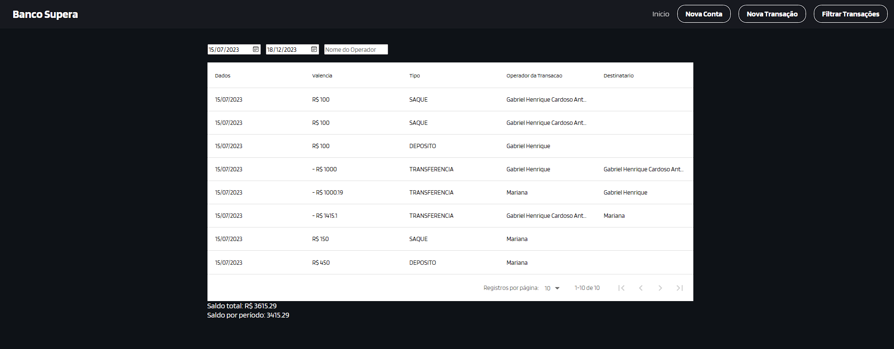
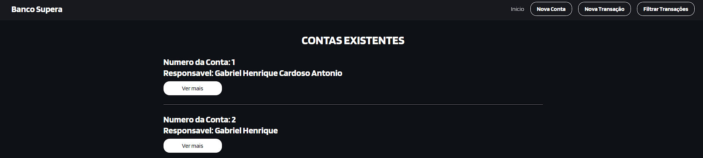
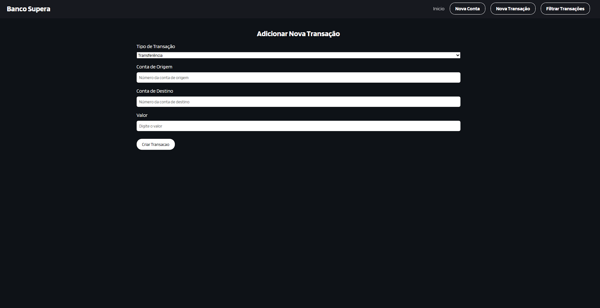
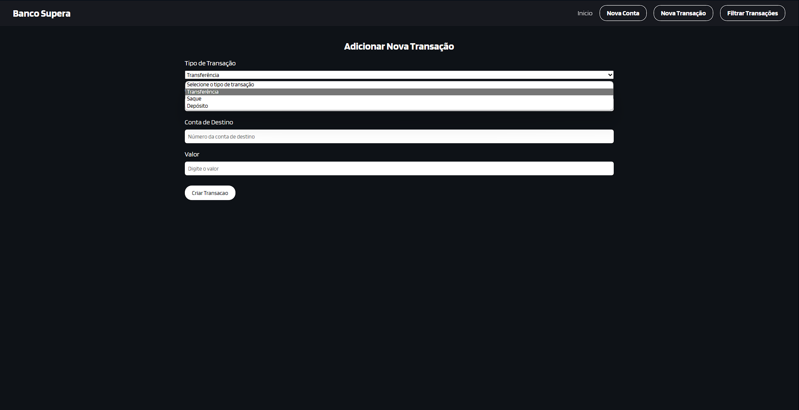

# Front-end da Aplicação Supera
Este é o repositório do front-end da [PS-Java-React](https://github.com/GabrielHenriqueCA/PS-Java-React), uma aplicação de demonstração criada para fins de estudo como parte de um processo seletivo. O front-end é responsável por fornecer uma interface de usuário interativa e amigável para os clientes.

## Funcionalidades

- Visualização de saldo e extrato bancário
- Transferência de fundos entre contas
- Criação de Contas
- 
## Tecnologias Utilizadas

- HTML5
- CSS3
- JavaScript
- React.js
- Axios

## Como Executar o Projeto

Siga as etapas abaixo para executar o front-end do Banco XYZ em seu ambiente local:

1. Clone este repositório para o seu computador:
   ```
   git clone https://github.com/GabrielHenriqueCA/PS-Java-React-Front.git
   ```

2. Navegue até o diretório clonado:
   ```
   cd PS-Java-React-Front
   ```

3. Instale as dependências do projeto:
   ```
   npm install
   ```

4. Inicie o servidor de desenvolvimento:
   ```
   npm start
   ```

5. Abra o navegador e acesse `http://localhost:3000` para visualizar a aplicação.

## Screenshots

Aqui estão algumas capturas de tela da aplicação:









## Contribuição

Contribuições para melhorias são bem-vindas. Se você deseja contribuir com o projeto, siga as etapas abaixo:

1. Crie um fork deste repositório.

3. Crie uma branch para suas alterações:
   ```
   git checkout -b feature/sua-feature
   ```
4. Faça as alterações desejadas e faça commit delas:
   ```
   git commit -m "Adicionar sua feature"
   ```
5. Envie suas alterações para o repositório remoto:
   ```
   git push origin feature/sua-feature
   ```
6. Abra um pull request neste repositório, descrevendo suas alterações.

## Licença

Este projeto está licenciado sob a [MIT License](LICENSE).

---
